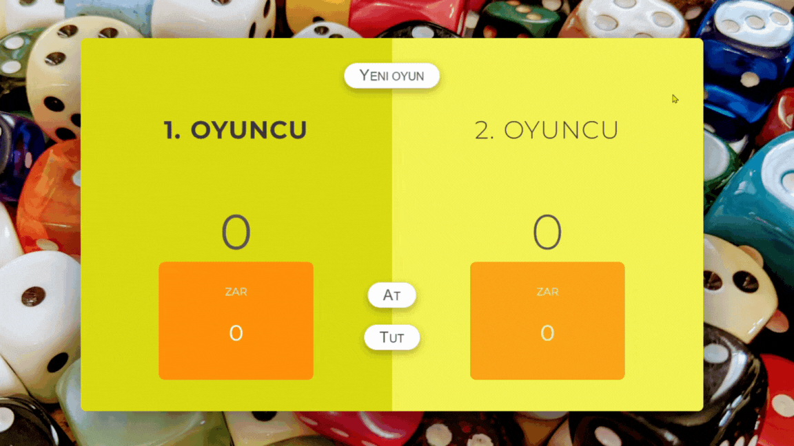

# Dice-Game

- This project is a JavaScript implementation of a simple dice game. In the game, two players take turns rolling a dice, and the value of each roll is added to the player's total score. However, if a player rolls a 1, the turn switches to the other player, and the current score for that turn is reset.

## Technologies Used
- JavaScript
- HTML
- CSS

## gif

